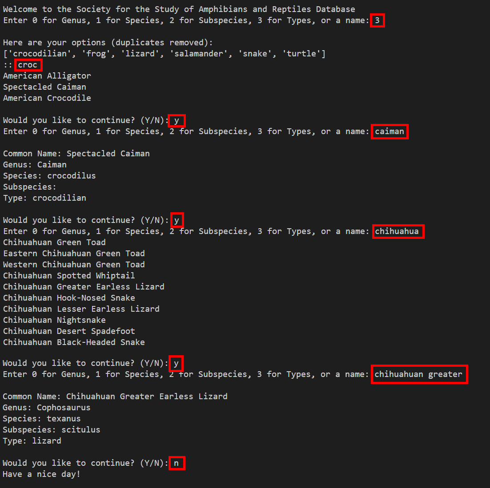

# Homework 5 - Herpetology 🦎🐍🐊🐢🐸
Homework 5 practice on dicts, sets, and strings

Data for this assignment comes from the Society for the Study of Amphibians and Reptiles (SSAR) [ssarherps.org](https://ssarherps.org/). Documentation for this dataset can be found on [GitHub](https://github.com/SSARHERPS/SSAR-species-database) if you are curious. The complete dataset includes many other fields that have been removed for simplicity.

In short, your program will allow the user to query data from SSAR. An example of what your final result might look like is given below. The parts marked in <span style="color:red">red</span> are user input.


## Part 1 - Instructions
This assignment is meant to ensure that you:
* Can manipulate real data and user input
* Understand `dict`, `set`, and `str`
* Gain experience accessing and searching through keys
* Implement and call user-defined functions
* Become familiar with the string functions

You will complete the functions in [hw5_herpetology.py](hw5_herpetology.py) to:

1. Define a function called `csvToDictOfLists` which accepts a file name as a parameter and then returns a dictionary of lists. This dictionary should contain the contents of the given file with the first element as the key and the rest of the comma seperated values stored as a list of strings linked to the key. The first line of the file (the headers) should not be included in the returned dictionary.

2. Define a function called `filterKeys` which accepts a dictionary as described in Step 1 and a string to filter against. It should then return a list of key values which coincide with the given string.

3. Define a function called `columnToSet` which accepts a dictionary as described in Step 1 and a column index then returns a set which contains all of the values from that column index. For example, if the index was zero then append all of the zeroth elements from the dictionary to the returned list.

4. Define a function called `filterByColumn` which accepts a dictionary as described in Step 1, a column index (similar to Step 3), and a string value. Then return a list of keys which have a column element that matches against the given string.

Then complete `main` so that the program interacts with the user to:
0. Read the data from the given comma separated value file.
1. Present the user with options for animals to list by `Genus`, `Species`, `Subspecies`, or `Type`. The user does not have to select any of these categories and can instead go on to Step 3.
2. Provide the user with all available options from the category they selected with duplicates removed. The user should then identify how they want to filter the reptiles and amphibians.
3. Search through the data to find all of the animals that could match the user's request then display them. In the event that only one animal matches the criteria, present all of the information associated with that animal. Should no animals match the criteria, then let the user know.
4. Ask the user if they wish to restart. In the event that they do, go to Step 1. Otherwise gracefully end the program.

See the screenshot given earlier for an example of this process in action. Your program does not need to look exactly like the screenshot.
 
 This lab assignment assumes input from the user and files. To ensure that GitHub can test and run your code, ***do not*** specify the entire path to the data file. Also add any regular keyboard input to the [keyboard_input.txt](keyboard_input.txt) file.

 ## Part 2 - Reflection
 Update the README to answer the following questions:

 1. Add a screenshot (or screenshots) here demonstrating how your program interacts with the user to display results.
 Screen Shot 2021-02-28 at 8.21.47 PM

 2. Describe two important differences between a `set` and a `list`.
 The two differences between a 'set' and a 'list' are: (i) set only contains unique values while list can contain duplicate values too (ii) items are unsorted in set so we cannot ask for a element in it using e.g. using set1[1], but in a list, we can fetch any element in it using e.g. list1[1]

 3. Explain dictionary's `keys()` and `values()` functions.
 A dictionary, there are 3 iterables. Two of them are keys() and values(). keys() function iterates over the keys of a dictionary while values() function iterates over values pf the dictionary. The functions are further illustrated with example below:
 e.g.
 dict1 = {'a': 'Australia', 'b': 'Brunei', 'c': 'China'}
 for i in dict1.keys():
    print (i, end = ' ')

ouptut gives: a b c

for i in dict1.values():
    print (i, end = ' ')

Output gives: Australia Brunei China

 4. What strategy did you use to ensure that your program worked even if the input capitalization did not match?
 I converted the input string into lowecase and compared it to the data in dictionary, also converted into lowercase. This avoided any mismatch due to any input capitalization encountered.

 5. Were there any names from the data that you found particularly interesting?
 Yes, I came across a name i.e. 'Alligator Snapping Turtle', which is exactly a subset of another name, 'Suwannee Alligator Snapping Turtle'.
 Because of this, the program does not display all the information associated with 'Alligator Snapping Turtle' as it is never the only match in the dictionary. 


 ---
 ## Running Tests Locally
 You do not have to wait for test results from GitHub because you can run tests on your own computer. The tester uses the program `pytest` which can be installed using the command `pip install -U pytest` (more info available at [https://docs.pytest.org](https://docs.pytest.org/en/stable/getting-started.html)). Use the following command to run `pytest`.

 ``` bash
 pytest
 ```
